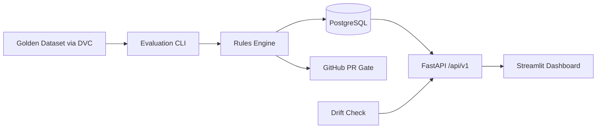

# Ares — Model Promotion Gate for ML Teams

  

Ares is an open-source regression gate that decides whether a candidate model is safe to promote. It combines reproducible golden datasets, configurable regression rules, champion tracking, drift reporting, CI-friendly evaluation outputs, and an operator dashboard into one decision system.

## Why Ares exists

Most teams can train a candidate model. Far fewer teams can answer the harder question: **should this model actually replace the current champion?**

Ares exists to make that decision:
- **reproducible** with versioned golden datasets and checksums,
- **governed** with explicit regression thresholds and critical-slice rules,
- **observable** through an API, dashboard, artifacts, and persisted history,
- **operational** through Docker, GitHub Actions, and drift-monitoring workflows.

## What Ares gives you

- Candidate-vs-champion evaluation with promotion-safe pass/fail logic
- Golden dataset validation with split-aware checks (`train`, `val`, `test`)
- Persisted evaluation history and champion export / recovery flows
- FastAPI endpoints for health, runs, champions, gate config, and drift reports
- Streamlit dashboard for leaderboard, drill-down analysis, and drift monitoring
- Optional MLflow logging, DVC-backed data workflow, and CI evaluation artifacts



## Quick start

### Full local stack

```bash
python -m venv .venv
. .venv/Scripts/activate
pip install -e ".[dev,eval,dashboard]"
docker compose up -d
python -m alembic upgrade head
python scripts/seed_champion.py
make verify
```

Notes:
- `docker compose up -d` brings up `db`, `redis`, `minio`, `mlflow`, `api`, `worker`, and `dashboard`.
- On Windows, this repository ships a `make.cmd` wrapper so `make verify` works even if GNU Make is not installed.
- Copy `.env.example` to `.env` only if you want to override local defaults.

### Key local surfaces

- API: `http://localhost:8000`
- OpenAPI docs: `http://localhost:8000/docs`
- Dashboard: `http://localhost:8501`
- MLflow: `http://localhost:5000`
- MinIO console: `http://localhost:9001`

## Verification

`make verify` is the main quality gate. It runs:
- Ruff
- Mypy
- Pytest with coverage and JUnit artifacts
- `docker compose config -q`
- `dvc repro --dry`
- Python bytecode checks for the dashboard entry points

Generated artifacts are written to `reports/` and are treated as local verification outputs, not source-controlled project files.

## Evaluator guide

Subclass `BaseEvaluator` and implement only `load_model()`, `predict()`, and `compute_metrics()`. The base class owns dataset validation, latency measurement, slice analysis, and result assembly.

## Threshold reference

Thresholds live in `ares.config.yaml`: F1/accuracy regression tolerance, critical slice floor, latency tolerance, significance alpha, and model size increase tolerance.

## DVC workflow

`dvc.yaml` defines an `evaluate` stage. Configure a real remote before `dvc push`; placeholder `.dvcconfig` is intentionally credential-free.

## Golden dataset policy

The bundled golden set is deterministic and split into `train.csv`, `val.csv`, and `test.csv`. Use `python scripts/seed_golden_set.py` to regenerate it and `python scripts/pin_golden_checksums.py` to pin SHA-256 checksums into `ares.config.yaml`.

`run_evaluation.py` defaults to the `val` split for iterative checks. Use `--split test` only for promotion-grade evaluations.

## API versioning and migration policy

Stable endpoints are under `/api/v1`. Breaking API changes require `/api/v2`. Production code must never call `Base.metadata.create_all()`; use Alembic migrations only.

## Promotion flow

1. Seed or register a baseline champion.
2. Run `scripts/run_evaluation.py` against a candidate model.
3. Review the gate result (`passed`, `failure_reason`, `metric_table`, slice regressions, validation summary).
4. Inspect the dashboard drill-down view if deeper analysis is needed.
5. Use the `test` split for promotion-grade decisions.

## CI/CD secrets

Configure `DATABASE_URL`, `ARES_API_KEYS`, cloud storage credentials for DVC, and package permissions for GHCR.

## Rollback and drift runbooks

Use `scripts/rollback.py --model-name <name>` to promote the previous champion. Nightly drift runs use `.github/workflows/drift_monitor.yml` and persist JSON reports.

## Promoting a Champion

Promotion-grade checks should run against the `test` split.

### GitHub UI

1. Open **Actions** in GitHub.
2. Select **Ares Regression Gate**.
3. Choose **Run workflow**.
4. Set `split=test`.
5. Trigger the workflow for the candidate branch or commit under review.

### GitHub CLI

```bash
gh workflow run regression_gate.yml -f split=test
```

Triggering this workflow requires repository **write** access or above. In practice, maintainer approval should be required before acting on the resulting promotion signal.

If the `test` split evaluation fails, the model must not be promoted.

## Boundaries

Ares DB owns champion state and gate decisions. MLflow owns artifacts/metrics. DVC owns golden data reproducibility. Deepchecks/Evidently are optional validation/drift integrations.

## Repository map

- `ares/` — core package: config, evaluators, rules engine, API, DB, drift, telemetry
- `dashboard/` — Streamlit UI for operators and reviewers
- `scripts/` — evaluation, seeding, rollback, and support utilities
- `data/` — bundled golden-set sample data and schema contract
- `.github/workflows/` — evaluation image build, regression gate, drift monitor, and quality automation

## Key rotation

Set `ARES_API_KEYS` to comma-separated keys. Add the new key, migrate consumers, then remove the old key. Legacy `ARES_API_KEY` is merged deterministically.

## Champion backup/recovery

Use `GET /api/v1/champions/export` for a JSON snapshot of active champions and reconstruction references.