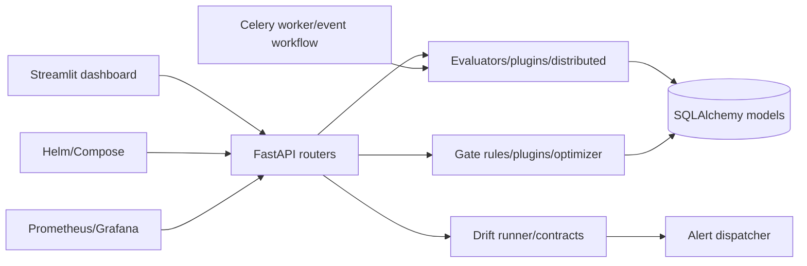

# ARES Architecture Explorer

Phase 4 architecture documentation links the current code graph, module boundaries, and operational paths.

## Generated graph artifacts

Graphify artifacts are expected under `graphify-out/core/`:

- `GRAPH_REPORT.md`
- `graph.json`
- `graph.html`

If regenerated locally, use the vendored Graphify package described in `Production_grade_final_plan.md` and commit the refreshed artifact set for release review.

## Current high-level map

## Reading order

1. `ares/api/routers/`
2. `ares/gate/`
3. `ares/evaluators/`
4. `ares/drift/`
5. `ares/worker/`
6. `deploy/`
