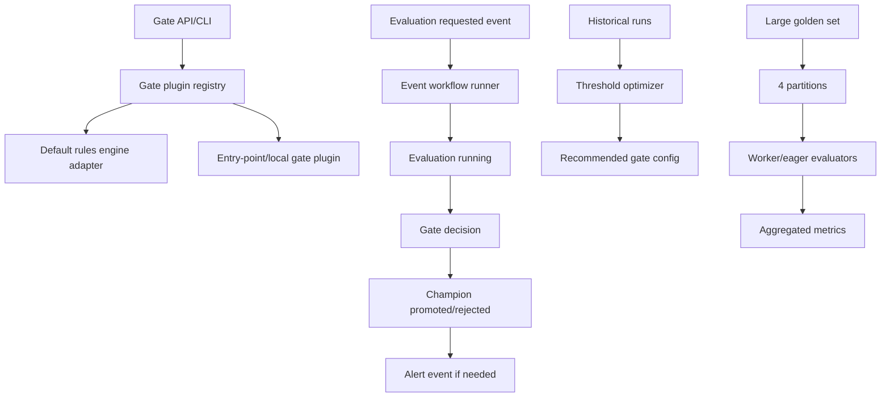

# Phase 4 Engineering Review

This review locks Phase 4 implementation before code, following `gstack-main/plan-eng-review/SKILL.md`.

## Architecture

## Boundary decisions

- `ares/gate/plugins.py` owns gate protocol and registry. `rules_engine.py` remains default logic source.
- `ares/gate/threshold_optimizer.py` owns offline threshold search and recommendation types.
- `ares/worker/event_workflow.py` owns event transition orchestration with an eager in-process runner for tests and Celery wrapping.
- `ares/evaluators/distributed.py` owns partition/aggregate helpers and does not duplicate evaluator metrics.
- Scripts are thin wrappers around importable modules.

## Test plan

- Unit: gate plugin registry/contract/failure/isolation, threshold optimizer properties, distributed partition aggregation.
- Integration: event chain requested -> running -> gate -> champion status -> alert, distributed 1000-row/4-partition behavior.
- Contract/smoke/docs: API client contract expansion, sandbox smoke marked and safe, mutation baseline docs.

## Risk controls

- Entry point loading failures are contained and surfaced as registry errors.
- Plugins are trusted code and allowlisted by config where configured.
- Event workflow is idempotency-friendly by job ID and explicit state transitions.
- Distributed evaluation test uses deterministic synthetic data and eager workers to avoid requiring a live broker.
- Final release gate must distinguish local evidence from Docker/staging-target-dependent evidence.
